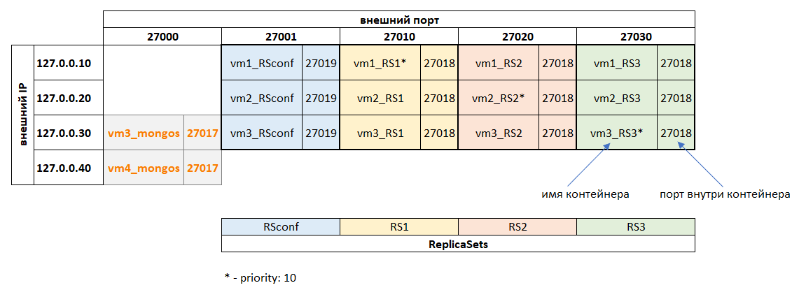

**1. Построить шардированный кластер из 3 кластерных нод (по 3 инстанса с репликацией) и с кластером конфига (3 инстанса);**
**2. Добавить балансировку, нагрузить данными, выбрать хороший ключ шардирования, посмотреть как данные перебалансируются между шардами;**
**3. Поронять разные инстансы, посмотреть, что будет происходить, поднять обратно. Описать что произошло.**
**4. Настроить аутентификацию и многоролевой доступ;**

Шардированный кластер будем делать с помощью docker’а.
Будет развернуто 14 контейнеров: 4 репликасета по 3 ноды (3 репликасеты под данные, 1 под конфиги) + 2 контейнера под mongos. Общая схема представлена на рисунке.



Готовим папки под данные, логи, журналирование:
```
sudo rm -rf /home/mongo_cluster
sudo mkdir /home/mongo_cluster
sudo mkdir /home/mongo_cluster/{vm1_RSconf,vm2_RSconf,vm3_RSconf,vm1_RS1,vm2_RS1,vm3_RS1,vm1_RS2,vm2_RS2,vm3_RS2,vm1_RS3,vm2_RS3,vm3_RS3,vm3_mongos,vm4_mongos}
sudo chmod 777 /home/mongo_cluster/{vm1_RSconf,vm2_RSconf,vm3_RSconf,vm1_RS1,vm2_RS1,vm3_RS1,vm1_RS2,vm2_RS2,vm3_RS2,vm1_RS3,vm2_RS3,vm3_RS3,vm3_mongos,vm4_mongos}
```

Генерируем ключ авторизации (аутентификация шардированного кластера без него не пройдет). После генерации раскладываем его по папкам, в которые будут писать контейнеры (файлу обязательно нужно проставить права уровня __«только владелец файла может читать/записывать»__ (иначе словим ошибку _«permissions on /data/key.file are too open»_), кроме того владельца меняем на __vboxadd__ (поскольку контейнеры докера запускаются под ним).
```
openssl rand -base64 756 > key.file
for dest in /home/mongo_cluster/{vm1_RSconf,vm2_RSconf,vm3_RSconf,vm1_RS1,vm2_RS1,vm3_RS1,vm1_RS2,vm2_RS2,vm3_RS2,vm1_RS3,vm2_RS3,vm3_RS3,vm3_mongos,vm4_mongos};
	do cp -v key.file "$dest" && sudo chmod 600 "$dest"/key.file && sudo chown vboxadd "$dest"/key.file;
done;
```
Все контейнеры будут функционировать внутри сети _net0_ и будут видеть друг друга. Наружу выведем их видимость через мэппинг портов (_см. схему выше_), процессы __mongod__, __mongos__  запускаем с параметром _--bind_ip  localhost_ (чтобы извне можно было к ним достучаться).

## Авторизация

В каждом репликасете один узел запускается как standalone-узел (т.е без параметров _--replSet, --configsvr, --shardsvr_) с авторизацией через параметры предопределенные контейнера __MONGO_INITDB_ROOT_USERNAME__, __MONGO_INITDB_ROOT_PASSWORD__. Только так удается зайти и прописать новых пользователей, которые потом раскопируются по другим узлам репликасета.

Запускаем [docker-compose.yml](docker-compose.yml)

Проверяем, что контейнеры активны командой ```docker  ps -a```. Контейнеры запустились, теперь можно заняться авторизацией.

Для __RSconf__ добавляем  пользователя  с  ролью _clusterAdmin_ (clusterManager + clusterMonitor + hostManager).
```
mongosh --host 127.0.0.10 --port 27001  -u "userRoot" -p "Passw0rd!" --authenticationDatabase "admin" --eval "db.createUser({user: \"UserClusterAdmin\",pwd: \"Passw0rd\!\", roles: [ \"clusterAdmin\" ]})" admin
```
Для __RS1, RS2, RS3__ пользователя с ролью _dbAdmin_ (изменять схему, индексы, смотреть статистику).
```
for i in {1..3};
	do mongosh --host 127.0.0.10 --port 270$i\0  -u "userRoot" -p "Passw0rd!" --authenticationDatabase "admin" --eval "db.createUser({user: \"UserDBAdmin\",pwd: \"Passw0rd\!\", roles: [ { role: \"dbAdmin\", db: \"*\" } ]})" admin;
done;
```
Перезапускаем standalone-ноды как репликасеты (через них после инициализации разъедутся новые пользователи на другие ноды).
```
docker stop vm1_RSconf && docker rm vm1_RSconf && docker run -d -p 127.0.0.10:27001:27019 -v /home/mongo_cluster/vm1_RSconf:/data --net leont_net0 --name vm1_RSconf mongo:6.0.3 mongod --replSet RSconf --configsvr --port 27019 --keyFile /data/key.file --auth --dbpath /data --logpath /data/mongod.log --bind_ip localhost,vm1_RSconf;

for i in {1..3};
	do docker stop vm1_RS$i && docker rm vm1_RS$i && docker run -d -p 127.0.0.10:270$i\0:27018 -v /home/mongo_cluster/vm1_RS$i:/data --net leont_net0 --name vm1_RS$i mongo:6.0.3 mongod --replSet RS$i --shardsvr --port 27018 --keyFile /data/key.file --auth --dbpath /data --logpath /data/mongod.log --bind_ip localhost,vm1_RS$i;
done;
```
Проверяем, что запустились ```docker ps -a```

Инициируем сами репликасеты: __RSconf, RS1, RS2, RS3__.
```
mongosh --host 127.0.0.10 --port 27001  -u "UserClusterAdmin" -p "Passw0rd!" --authenticationDatabase "admin" --eval "rs.initiate({_id: \"RSconf\", configsvr: true, members: [{_id: 0, host: \"vm1_RSconf:27019\"},{_id: 1, host: \"vm2_RSconf:27019\"}, {_id: 2, host: \"vm3_RSconf:27019\"} ] })"

mongosh --host 127.0.0.10 --port 27010  -u "userRoot" -p "Passw0rd!" --authenticationDatabase "admin" --eval "rs.initiate({_id: \"RS1\", members: [{_id: 0, host: \"vm1_RS1:27018\", priority: 10},{_id: 1, host: \"vm2_RS1:27018\"}, {_id: 2, host: \"vm3_RS1:27018\"} ] })"
mongosh --host 127.0.0.10 --port 27020  -u "userRoot" -p "Passw0rd!" --authenticationDatabase "admin" --eval "rs.initiate({_id: \"RS2\", members: [{_id: 0, host: \"vm1_RS2:27018\"},{_id: 1, host: \"vm2_RS2:27018\", priority: 10}, {_id: 2, host: \"vm3_RS2:27018\"} ] })"
mongosh --host 127.0.0.10 --port 27030  -u "userRoot" -p "Passw0rd!" --authenticationDatabase "admin" --eval "rs.initiate({_id: \"RS3\", members: [{_id: 0, host: \"vm1_RS3:27018\"},{_id: 1, host: \"vm2_RS3:27018\"}, {_id: 2, host: \"vm3_RS3:27018\", priority: 10} ] })"
```
Проверить, что новые пользователи раскопировались на остальные ноды внутри репликасета, можно командой:
```
mongosh --host 127.0.0.30 --port 27030 -u "userRoot" -p "Passw0rd!" --authenticationDatabase "admin" --eval "db.system.users.find()" admin
```
Авторизация на __mongos__. Поскольку mongos-процесс своих данных не имеет (поэтому и запускаем без _--dbpath_), сведения о пользователях автоматически подтягивает с нод, путь к которым передан через _--configdb_ параметр. Кроме того, при запуске mongos  потребовал _--keyfile_, но не нужен _--auth_  параметр.

## Собираем шардированный кластер

Заходим на mongos  под ролью _clusterAdmin_ и добавляем шарды.
```
mongosh --host 127.0.0.40 --port 27000 -u "UserClusterAdmin" -p "Passw0rd!" --authenticationDatabase "admin"

use admin
sh.addShard("RS1/vm1_RS1:27018,vm2_RS1:27018,vm3_RS1:27018")
sh.addShard("RS2/vm1_RS2:27018,vm2_RS2:27018,vm3_RS2:27018")
sh.addShard("RS3/vm1_RS3:27018,vm2_RS3:27018,vm3_RS3:27018")

sh.status()
```
Можно зайти на __vm3_mongos__  и проверить, что ```sh.status() ``` показывает тоже самое, что и __vm4_mongos__.

Загружаем коллекцию из 757357 строк. Данные с датчиков Лондона по качеству воздуха ([https://data.london.gov.uk/dataset/breathe-london-aqmesh-pods](https://data.london.gov.uk/dataset/breathe-london-aqmesh-pods)): id  датчика, его расположение (широта, долгота, название местности, дата/время репортирования, измерения диоксида азота NO2 и взвеси частиц до 2.5 мкм PM2.5)
> pod_id_location, pod_id, location_name, latitude, longitude, date_utc, pm2_5_ugm3, ratification_status_pm2_5, no2_ugm3, ratification_status_no2

Портируем данные с помощью утилиты mongoimport:
```
mongoimport -h 127.0.0.40 --port 27000 -u "userRoot" -p "Passw0rd!" --authenticationDatabase "admin" -d stationary -c data --type csv --headerline --ignoreBlanks --stopOnError //media/sf_Downloads/VM\ data/stationary_data.csv
```
> [########################] stationary.data  62.4MB/62.4MB (100.0%)
757357 document(s) imported successfully. 0 document(s) failed to import.

В MonogoDB 6.0 размер чанка  по умолчанию 128 Мб, будем его уменьшать до 8 Мб.
```
mongosh --host 127.0.0.40 --port 27000 -u "UserClusterAdmin" -p "Passw0rd!" --authenticationDatabase "admin"

use config
db.settings.updateOne({ _id: "chunksize"}, { $set: { _id: "chunksize", value: 8 }},{upsert: true})
db.settings.find()
```
> [ { _id: 'chunksize', value: 8 } ]

Проверяем командой ```db.databases.find()``` на какой шард уехала только что загруженная коллекция.
> primary: ‘RS2’

В качестве ключа шардирования выбираем георгафические координаты датчиков, создаем на эти поля индекс и запускаем балансировщик.
```
use stationary
db.data.createIndex({latitude: 1, longitude: 1})

use admin
sh.shardCollection("stationary.data",{latitude: 1, longitude: 1})
sh.status()
```
> collections: {
	'stationary.data': {
	__shardKey: { latitude: 1, longitude: 1 },__
	unique: false,
	balancing: true,
	chunkMetadata: [
		__{ shard: 'RS1', nChunks: 8 },__
		__{ shard: 'RS2', nChunks: 1 },__
		__{ shard: 'RS3', nChunks: 8 }__
	],
	chunks: [
		{ min: { latitude: MinKey(), longitude: MinKey() }, max: { latitude: 51.42661, longitude: -0.345043 }, 'on shard': 'RS3', 'last modified': Timestamp({ t: 2, i: 0 }) },
		{ min: { latitude: 51.42661, longitude: -0.345043 }, max: { latitude: 51.455096000000005, longitude: -0.243402 }, 'on shard': 'RS1', 'last modified': Timestamp({ t: 3, i: 0 }) },
		{ min: { latitude: 51.455096000000005, longitude: -0.243402 }, max: { latitude: 51.457879999999996, longitude: 0.135353 }, 'on shard': 'RS1', 'last modified': Timestamp({ t: 4, i: 0 }) },
		{ min: { latitude: 51.457879999999996, longitude: 0.135353 }, max: { latitude: 51.468625, longitude: -0.35977 }, 'on shard': 'RS3', 'last modified': Timestamp({ t: 5, i: 0 }) },
		{ min: { latitude: 51.468625, longitude: -0.35977 }, max: { latitude: 51.474326, longitude: -0.078151 }, 'on shard': 'RS1', 'last modified': Timestamp({ t: 6, i: 0 }) },
		{ min: { latitude: 51.474326, longitude: -0.078151 }, max: { latitude: 51.481228, longitude: 0.12678699999999998 }, 'on shard': 'RS3', 'last modified': Timestamp({ t: 7, i: 0 }) },
		{ min: { latitude: 51.481228, longitude: 0.12678699999999998 }, max: { latitude: 51.4831, longitude: -0.0188 }, 'on shard': 'RS1', 'last modified': Timestamp({ t: 8, i: 0 }) },
		{ min: { latitude: 51.4831, longitude: -0.0188 }, max: { latitude: 51.488199, longitude: -0.255688 }, 'on shard': 'RS3', 'last modified': Timestamp({ t: 9, i: 0 }) },
		{ min: { latitude: 51.488199, longitude: -0.255688 }, max: { latitude: 51.495027, longitude: 0.010292 }, 'on shard': 'RS1', 'last modified': Timestamp({ t: 10, i: 0 }) },
		{ min: { latitude: 51.495027, longitude: 0.010292 }, max: { latitude: 51.501862, longitude: -0.19241 }, 'on shard': 'RS3', 'last modified': Timestamp({ t: 11, i: 0 }) },
		{ min: { latitude: 51.501862, longitude: -0.19241 }, max: { latitude: 51.506130999999996, longitude: -0.088654 }, 'on shard': 'RS1', 'last modified': Timestamp({ t: 12, i: 0 }) },
		{ min: { latitude: 51.506130999999996, longitude: -0.088654 }, max: { latitude: 51.510768, longitude: -0.20529 }, 'on shard': 'RS3', 'last modified': Timestamp({ t: 13, i: 0 }) },
		{ min: { latitude: 51.510768, longitude: -0.20529 }, max: { latitude: 51.51419, longitude: -0.16197899999999998 }, 'on shard': 'RS3', 'last modified': Timestamp({ t: 14, i: 0 }) },
		{ min: { latitude: 51.51419, longitude: -0.16197899999999998 }, max: { latitude: 51.518122999999996, longitude: -0.074271 }, 'on shard': 'RS1', 'last modified': Timestamp({ t: 15, i: 0 }) },
		{ min: { latitude: 51.518122999999996, longitude: -0.074271 }, max: { latitude: 51.521004, longitude: -0.046558999999999996 }, 'on shard': 'RS3', 'last modified': Timestamp({ t: 16, i: 0 }) },
		{ min: { latitude: 51.521004, longitude: -0.046558999999999996 }, max: { latitude: 51.52304, longitude: -0.174732 }, 'on shard': 'RS1', 'last modified': Timestamp({ t: 17, i: 0 }) },
		{ min: { latitude: 51.52304, longitude: -0.174732 }, max: { latitude: MaxKey(), longitude: MaxKey() }, 'on shard': 'RS2', 'last modified': Timestamp({ t: 17, i: 1 }) }
	],
	tags: []
}

Чанки разъехались 8-1-8.
```
use stationary
db.data.find().count()
```
Первое время показывает 1227257 записей. Если запросим статистику ```db.stats()```, то увидим, что данные по __RS1__ и __RS3__ разъехались, но на __RS2__ еще избыточные не удалились.

>{
raw: {
	'RS3/vm1_RS3:27018,vm2_RS3:27018,vm3_RS3:27018': {
		db: 'stationary',
		collections: 1,
		views: 0,
		__objects: 230862,__
	},
  'RS1/vm1_RS1:27018,vm2_RS1:27018,vm3_RS1:27018': {
		db: 'stationary',
		collections: 1,
		views: 0,
		__objects: 239038,__
	},
	'RS2/vm1_RS2:27018,vm2_RS2:27018,vm3_RS2:27018': {
		db: 'stationary',
		collections: 1,
		views: 0,
		__objects: 757357,__
	}
},
__objects: 1227257,__
}

Через какое-то время ```db.data.find().count()``` вернет корректное 757357, а ```db.stats()``` покажет что на __RS2__ осталось 287457 записей. Балансировка окончена.

Сразу создадим пользователей с урезанными правами для работы с БД stationary.
```
mongosh --host 127.0.0.40 --port 27000 -u "userRoot" -p "Passw0rd!" --authenticationDatabase "admin"

use admin
db.createUser({user: "UserReadWrite",pwd: "Passw0rd!", roles: [ {role: "readWrite", db: "stationary" } ]})
db.createUser({user: "UserAdminDatabase",pwd: "Passw0rd!", roles: [ { role: "dbOwner", db: "stationary" } ]})
```

## Моделируем ситуацию с падением нод

Останавливаем 2 из 3-х нод репликасета __RS3__: 
```
docker stop vm1_RS3 && docker stop vm2_RS3

mongosh --host 127.0.0.40 --port 27000 -u "UserReadWite" -p "Passw0rd!" --authenticationDatabase "admin"

use stationary
db.data.aggregate([{$group: {_id: '$latitude', totalrecords: {$sum: 1}}}, {$sort: {'_id': 1}}])
```
> MongoServerError: Could not find host matching read preference { mode: "primary" } for set RS3
> lastHeartbeatMessage: 'Error connecting to vm1_RS3:27018 :: caused by :: Could not find address for vm1_RS3:27018: SocketException: Host not found (non-authoritative), try again later',

Если зайти на __RS3__ и посмотреть ```rs.status()```, то оставшийся живым узел не может выполнять функцию primary-ноды (перешел в статус secondary).

>name: 'vm3_RS3:27018',
stateStr: 'SECONDARY',

Заходим в _mongos.log_  файл ноды __vm3_RS3__ и видим, что сыпется:

> {"t":{"$date":"2023-01-04T10:58:20.264+00:00"},"s":"I",  "c":"NETWORK",  "id":4712102, "ctx":"ReplicaSetMonitor-TaskExecutor","msg":"Host failed in replica set","attr":{"replicaSet":"RS3","host":"vm1_RS3:27018","error":{"code":6,"codeName":"HostUnreachable","errmsg":"Error connecting to vm1_RS3:27018 :: caused by :: Could not find address for vm1_RS3:27018: SocketException: Host not found (non-authoritative), try again later"},"action":{"dropConnections":true,"requestImmediateCheck":true}}}
>
>{"t":{"$date":"2023-01-04T10:58:20.284+00:00"},"s":"I",  "c":"REPL_HB",  "id":23974,  "ctx":"ReplCoord-8","msg":"Heartbeat failed after max retries","attr":{"target":"vm2_RS3:27018","maxHeartbeatRetries":2,"error":{"code":6,"codeName":"HostUnreachable","errmsg":"Error connecting to vm2_RS3:27018 :: caused by :: Could not find address for vm2_RS3:27018: SocketException: Host not found (non-authoritative), try again later"}}}
> 
> {"t":{"$date":"2023-01-04T10:58:20.285+00:00"},"s":"I",  "c":"REPL_HB",  "id":23974,  "ctx":"ReplCoord-11","msg":"Heartbeat failed after max retries","attr":{"target":"vm1_RS3:27018","maxHeartbeatRetries":2,"error":{"code":6,"codeName":"HostUnreachable","errmsg":"Error connecting to vm1_RS3:27018 :: caused by :: Could not find address for vm1_RS3:27018: SocketException: Host not found (non-authoritative), try again later"}}}

Поднимаем ```docker start vm2_RS3```. Сразу __RS3__ возвращается в строй, __vm3_RS3__ выбран как primary-узел, можно работать с БД (не смотря на то, что __vm1_RS3__ остался в статусе unhealthy).

Если останавливаем 2 ноды __RSconf__ репликасета, где хранятся конфиги, то на команду ```sh.status()``` получаем:

> MongoServerError: Encountered non-retryable error during query :: caused by :: Could not find host matching read preference { mode: "primary" } for set RSconf

С двумя живыми нодами __RSconf__  проблема исчезает ```sh.status()``` откликается актуальным статусом.

По окончании тестирования останавливаем запущенные контейнеры, чистим ресурсы.
```
docker-compose down
docker container stop $(docker ps -aq) && docker container rm $(docker ps -aq)
docker network rm leont_net0
docker volume prune
```
