**Развернуть кластер Couchbase**

**Создать БД, наполнить небольшими тестовыми данными**

**Проверить отказоустойчивость**

Разворачиваем кластер из 5 нод на виртуальной машине (*RAM 8Gb, AMD  Ryzen 5 4600H  3.00 GHz, 6 CPU  cores*).

Готовим  папки  под  данные:
```
sudo rm -rf /home/couch_cluster && sudo mkdir /home/couch_cluster &&  sudo mkdir /home/couch_cluster/couch{1..5} && sudo chmod 777 /home/couch_cluster/couch{1..5}
```
Запускаем [docker-compose.yml](docker-compose.yml)
```
docker-compose up -d
docker ps -a

CONTAINER ID  IMAGE  COMMAND  CREATED  STATUS  PORTS  NAMES
e6fd2111d2b8  couchbase:7.0.5  "/entrypoint.sh couc…"  5 seconds ago  Up 4 seconds  8091-8097/tcp, 9123/tcp, 11207/tcp, 11210/tcp, 11280/tcp, 18091-18097/tcp  couch5
d3abc65d8645  couchbase:7.0.5  "/entrypoint.sh couc…"  6 seconds ago  Up 5 seconds  8091-8097/tcp, 9123/tcp, 11207/tcp, 11210/tcp, 11280/tcp, 18091-18097/tcp  couch4
218d39f2a3fd  couchbase:7.0.5  "/entrypoint.sh couc…"  7 seconds ago  Up 5 seconds  8091-8097/tcp, 9123/tcp, 11207/tcp, 11210/tcp, 11280/tcp, 18091-18097/tcp  couch3
771b606c7235  couchbase:7.0.5  "/entrypoint.sh couc…"  7 seconds ago  Up 6 seconds  8091-8097/tcp, 9123/tcp, 11207/tcp, 11210/tcp, 11280/tcp, 18091-18097/tcp  couch2
4e8b904d3b50  couchbase:7.0.5  "/entrypoint.sh couc…"  8 seconds ago  Up 7 seconds  8097/tcp, 9123/tcp, 0.0.0.0:8091-8096->8091-8096/tcp, :::8091-8096->8091-8096/tcp, 11207/tcp, 11280/tcp, 0.0.0.0:11210-11211->11210-11211/tcp, :::11210-11211->11210-11211/tcp, 18091-18097/tcp  couch1
```
Переходим по адресу http://127.0.0.1:8091/ui/index.html, нам предлагают создать кластер через UI. Но будем подключать ноды и объединять их в кластер через CLI.

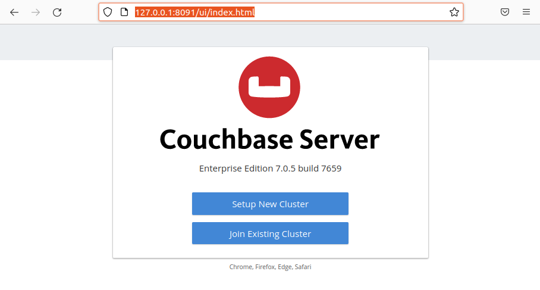

Выведем ip  нод внутри сети докера:
```
for i in {1..5}; do docker inspect -f '{{range .NetworkSettings.Networks}}{{.IPAddress}}{{end}}' couch$i; done;
172.27.0.2
172.27.0.3
172.27.0.4
172.27.0.5
172.27.0.6
```
## Собираем кластер
Кластер будет содержать следующюю конфигурацию сервисов:

**couch1** - data

**couch2** - data, query

**couch3** - data, index

**couch4** - index, query

**couch5** - analytisc, search, backup, eventing

Заходим в контейнер с первой нодой, будем работать с ```couchbase-cli``` (там она уже установлена).
Сначала инициализируется нода:
```
docker exec -it couch1 /bin/bash

couchbase-cli node-init -c 172.27.0.2 -u admin -p Passw0rd! --node-init-data-path /opt/couchbase/var/lib/couchbase/data --node-init-index-path /opt/couchbase/var/lib/couchbase/index --node-init-eventing-path /opt/couchbase/var/lib/couchbase/eventing --node-init-analytics-path /opt/couchbase/var/lib/couchbase/analytics --ipv4
SUCCESS: Node  initialized
```

Следом инициализируем кластер, доступ к которому будет по 127.0.0.1
```
couchbase-cli cluster-init -c 127.0.0.1 --cluster-username admin --cluster-password Passw0rd! --services data --cluster-ramsize 4103 --cluster-index-ramsize 512
SUCCESS: Cluster initialized
```
К этому моменту уже можно войти в кластер по логину/паролю:
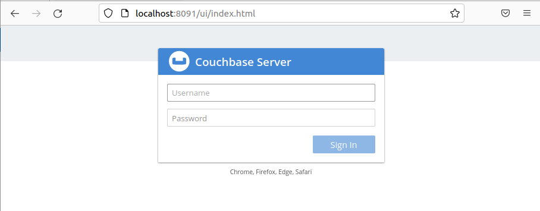

Добавляем остальные ноды и запускаем ребалансировку (всё продолжаем делать внутри контейнера **couch1**):
```
couchbase-cli server-add -c 172.27.0.2:8091 --username admin --password Passw0rd! --server-add https://172.27.0.3:18091 --server-add-username admin --server-add-password Passw0rd! --services data,query
couchbase-cli server-add -c 172.27.0.2:8091 --username admin --password Passw0rd! --server-add https://172.27.0.4:18091 --server-add-username admin --server-add-password Passw0rd! --services data,index
couchbase-cli server-add -c 172.27.0.2:8091 --username admin --password Passw0rd! --server-add https://172.27.0.5:18091 --server-add-username admin --server-add-password Passw0rd! --services index,query
couchbase-cli server-add -c 172.27.0.2:8091 --username admin --password Passw0rd! --server-add https://172.27.0.6:18091 --server-add-username admin --server-add-password Passw0rd! --services fts,eventing,analytics,backup
couchbase-cli rebalance -c 172.27.0.2:8091 --username admin --password Passw0rd!
```
Проверяем статус нод и логинимся в UI:
```
couchbase-cli server-list -c 172.27.0.2:8091 --username admin --password Passw0rd!

ns_1@172.27.0.2 172.27.0.2:8091 healthy active
ns_1@172.27.0.3 172.27.0.3:8091 healthy active
ns_1@172.27.0.4 172.27.0.4:8091 healthy active
ns_1@172.27.0.5 172.27.0.5:8091 healthy active
ns_1@172.27.0.6 172.27.0.6:8091 healthy active
```
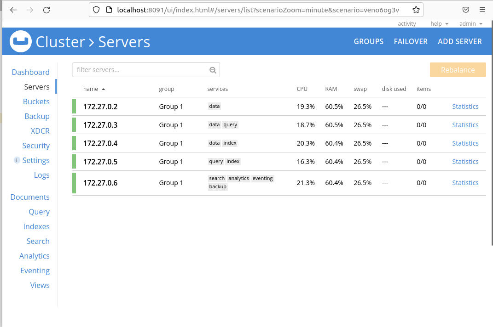

Загружаем  датасет [historical_events.json](datasets/historical_events.json) для тестов с данными.
Сначала файл перемещаем на открытый для контейнера volume:
```
cp -v /media/sf_Downloads/VM\ data/historical_events.json /home/couch_cluster/couch1
```
Потом проваливаемся в контейнер ```docker exec -it couch1 /bin/bash```, создаем новый бакет **history** (указываем в настройках, чтобы хранились на 2 репликах) и портируем данные через утилиту ```cbimport```:
```
couchbase-cli bucket-create --cluster 172.27.0.2:8091 --username admin --password Passw0rd! --bucket history --bucket-type couchbase --bucket-ramsize 3903 --bucket-replica 2
cbimport json --format list -c 172.27.0.2:8091 --username admin --password Passw0rd! -d 'file:///opt/couchbase/var/historical_events.json' -b 'history' --scope-collection-exp "_default._default" -g "#UUID#"

Documents  imported: 37859 Documents  failed: 0
```
## Работа с N1QL

Переходим на вкладку Query  и создаем индекс на коллекцию, с которой будем работать:
```
CREATE PRIMARY INDEX ON `default`:`history`.`_default`.`_default`
```
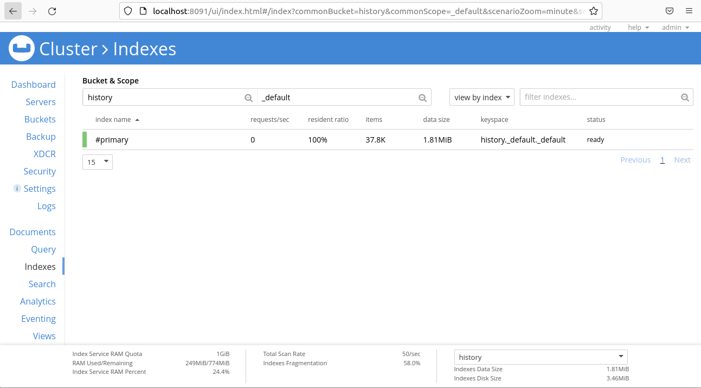

Несколько  запросов  на N1QL:
```
SELECT COUNT(*) FROM `history`._default._default where lang='en';
```
[query1.json](datasets/query1.json)
```
SELECT * FROM `history`._default._default WHERE category2='Persia' and date between '240' and '450' order by date limit 5
```
[query2.json](datasets/query2.json)
```
SELECT * FROM `history`._default._default WHERE description like '%king%territory%'
```
[query3.json](datasets/query3.json)
```
SELECT category1, count(*) as cnt FROM `history`._default._default group by category1 having count(*)>1000 order by category1
```
[query4.json](datasets/query4.json)
```
select *
from (select distinct category1, category2 from `history`._default._default) record
inner nest (
  select row_number() over (partition by category1, category2 order by description) as n, id, category1, category2, date, description, granularity, lang
  from `history`._default._default
  where description!='' and category1!=''
) events on record.category1=events.category1 and record.category2=events.category2
where n<=3
```
[query5.json](datasets/query5.json)

Два равнозначных варианта поиска записи по ключу:
```
SELECT * FROM `history`._default._default use keys '00206818-4357-4e18-aef3-5ed79dbb9946'

SELECT * FROM `history`._default._default where meta().id='00206818-4357-4e18-aef3-5ed79dbb9946'
```
```
[
  {
    "_default": {
      "category1": "By place",
      "category2": "Europe",
      "date": "830",
      "description": "Egbert of Wessex defeats the Welsh.",
      "granularity": "year",
      "lang": "en"
    }
  }
]
```
## Eventing
Добавим регистрацию событий (например, на удаление записи из коллекции **history**). Создадим отдельный бакет **historylog**, куда будем сбрасывать записи.

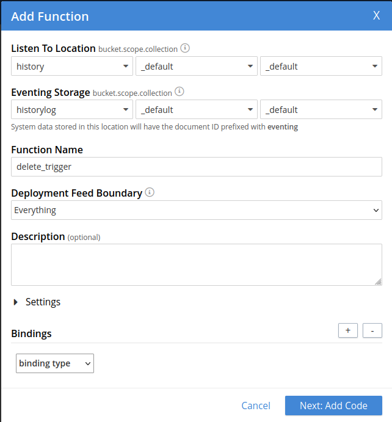

И пропишем код на регистрацию факта удаления документа из коллекции, записывать будем id документа.
```
function OnDelete(meta, options) {
  log("Doc deleted", meta.id);
}
```
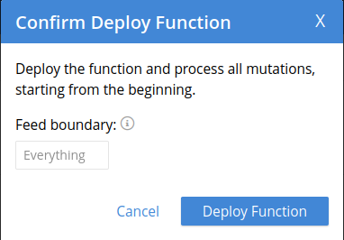

После непродолжительного времени ожидания, событие задеплоилось и можно пробовать. Запускаем несколько раз слудеющий код:
```
delete from `history`._default._default d0 where [meta().id] in (select raw [meta().id] as del_id from `history`._default._default d1 where category1="Date unknown" limit 1)
```
Можем посмотреть график событий.
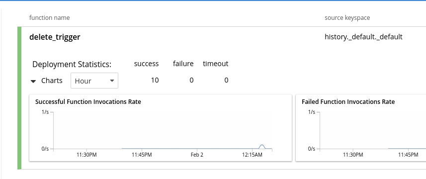

Либо открываем Log и видим результаты срабатывания функции.
```
2023-02-01T21:18:08.390+00:00 [INFO] "Doc deleted" "006ea2bd-ffc1-414d-8768-8434eb55d847"
2023-02-01T21:18:06.387+00:00 [INFO] "Doc deleted" "006e373b-637d-4da5-9d3b-3c8a2105587e"
2023-02-01T21:18:03.887+00:00 [INFO] "Doc deleted" "00521295-701a-4818-b6db-7d275b695a78"
2023-02-01T21:17:52.987+00:00 [INFO] "Doc deleted" "0045b3bf-b829-491c-bb06-9154407bf441"
2023-02-01T21:17:36.787+00:00 [INFO] "Doc deleted" "003a4fdd-ec78-4d23-947f-e90b6562c494"
2023-02-01T21:17:14.687+00:00 [INFO] "Doc deleted" "0011fa44-634a-4daf-873c-03797c85f8c1"
2023-02-01T21:13:43.687+00:00 [INFO] "Doc deleted" "00105036-6066-4167-8536-3fb1baeb6226"
2023-02-01T21:08:54.787+00:00 [INFO] "Doc deleted" "00071239-26c0-4296-a641-ed4a55e10a07"
2023-02-01T20:52:44.887+00:00 [INFO] "Doc deleted" "0003da34-dedf-49e4-83d4-3e8343aaa22e"
2023-02-01T20:48:36.492+00:00 [INFO] "Doc deleted" "00008eda-2517-422e-9b85-964289aee1ea"
```
## Бэкапирование
Добавляем план ежедневного бэкапирования всех коллекции:

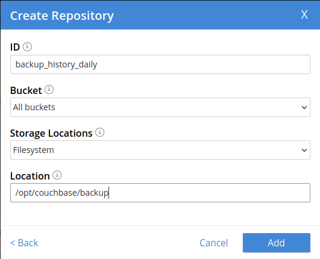

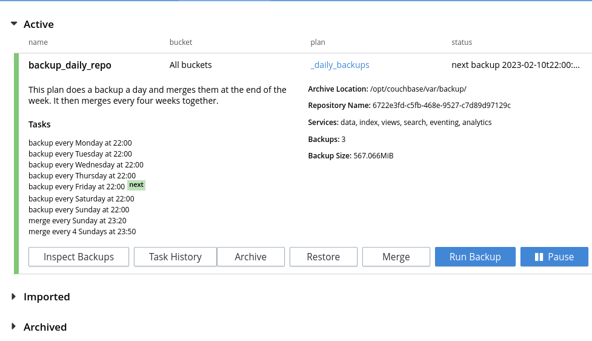

Через несколько дней проверяем что бэкапирование проходит.
В UI можно посмотреть статистические подробности, а на выделенном volume под ноду **couch5** проверить наличие самих файлов.
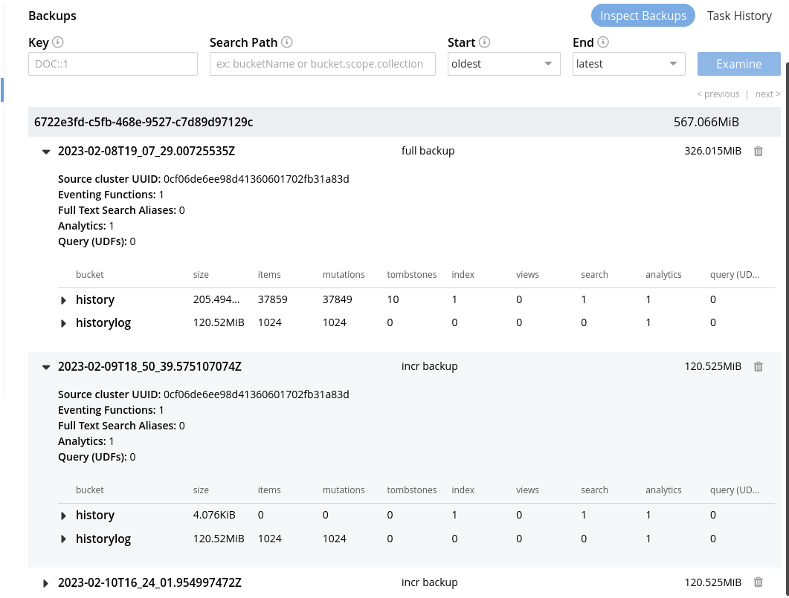
```
cd /home/couch_cluster/couch5/backup/6722e3fd-c5fb-468e-9527-c7d89d97129c$ ls -lh
total 20K
drwxrwx--- 4 leont leont 4,0K фев  8 22:07 2023-02-08T19_07_29.00725535Z
drwxrwx--- 4 leont leont 4,0K фев  9 21:50 2023-02-09T18_50_39.575107074Z
drwxrwx--- 4 leont leont 4,0K фев 10 19:24 2023-02-10T16_24_01.954997472Z
-rw-rw---- 1 leont leont  678 фев  7 22:13 backup-meta.json
-rw-rw---- 1 leont leont  312 фев  7 22:13 README.md
```

## Full Text Search
Настраиваем полнотекстовый поиск по полю *description*:

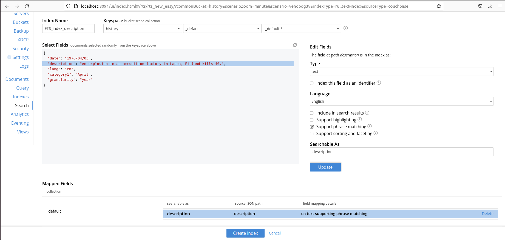

Сделаем  поиск, аналогичный ```SELECT * FROM `history`._default._default WHERE description like '%king%territory%'``` (см. раздел N1QL), но средствами FTS.
```
select meta().id, * from `history`._default._default where search(description, "+king +territory");
```
Получим результатов больше, например, за счет той же перестановки слов ([fts1.json](datasets/fts1.json))

Сделаем поиск конкретной фразы:
```
SELECT META().id, * FROM `history`._default._default as t1 WHERE SEARCH(t1, {"query": {"match_phrase": "King Otto"}, "fields":["description"]});
```
[fts2.json](datasets/fts2.json)

Тот же поиск сделаем через REST  API:
```
curl -XPOST -H "Content-Type: application/json" -u admin:Passw0rd! http://172.27.0.6:8094/api/index/FTS_index_description/query -d '{
  "query": {
    "match_phrase": "King Otto"
  },
  "fields":["description"]
}'
```
[fts3.json](datasets/fts3.json)

## Моделируем ситуацию с падением нод

Настраиваем оповещения на электронный ящик перед тем, как проводить отключение нод:
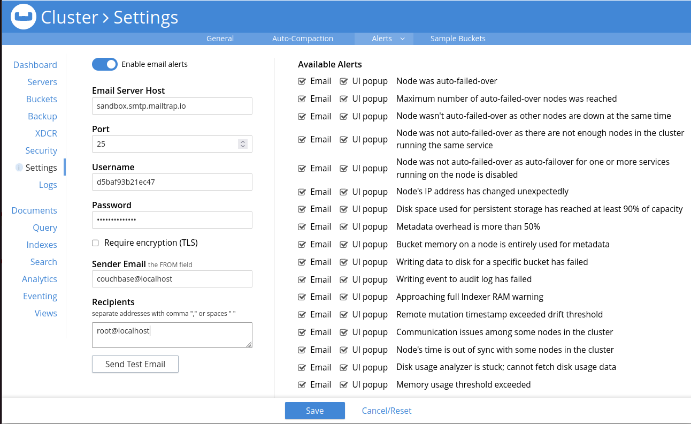

Выставляем  в  настройках: *“Auto-failover after **30** seconds for up to **1** event”*.

По текущей конфигурации кластера *Auto-failover* (нода недоступна, но сервис продолжит работать без вмешательства DBA, т.е. будет время на решение проблем с нодой) отработает на **couch1-couch4** (так как выполняется требование Couchbase  по минимальному кол-ву нод на сервисы *data=3, index=2, query=2*) и не отработает на **couch5** (fts, eventing, analytics, backup  запущены сейчас на одной, нужно для Auto-failover  минимум 2) (подробности в мануале [Automatic Failover settings](https://docs.couchbase.com/server/current/learn/clusters-and-availability/automatic-failover.html#failover-policy)).

### 1 тест:
Роняем ноду **couch3** (data, index): ```docker stop couch3```

Пришло письмо:  ```Node ('ns_1@172.27.0.4') was automatically failed over. Reason: All monitors report node is unhealthy```.

Что можно сделать:
> 1 вариант (нода серьезна вышла из строя, нужно выводить из кластера)

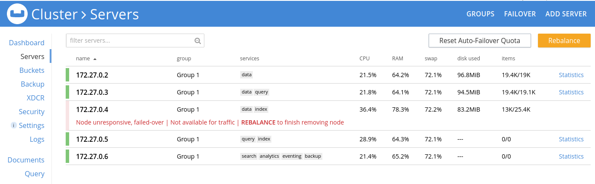

Заходим в UI, никакие действия с нодой уже недоступны, поэтому делаем **Rebalance** (данные перераспределяются), нода исчезает из кластера.
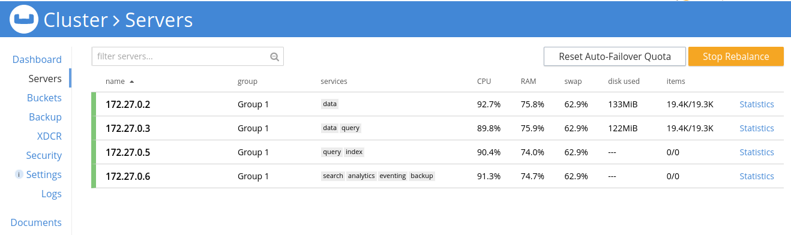

Если через какое-то время удастся восстановить ноду, её придется добавлять в кластер вручную.
```
docker start couch3

docker exec couch1 -it /bin/bash
couchbase-cli server-add -c 172.27.0.2:8091 --username admin --password Passw0rd! --server-add https://172.27.0.4:18091 --server-add-username admin --server-add-password Passw0rd! --services data,index
SUCCESS: Server added
couchbase-cli rebalance -c 172.27.0.2:8091 --username admin --password Passw0rd!
Rebalancing
Bucket: 02/02 (historylog)                                                                                                                                                                 0 docs remaining
[=============================================================+========] 100.00%
SUCCESS: Rebalance complete
```

> 2 вариант (временная недоступность ноды, ждем подключения)

Допустим, через какое-то время связь появилась, и нода стала вновь пингуема.
```
docker  start  couch3
```
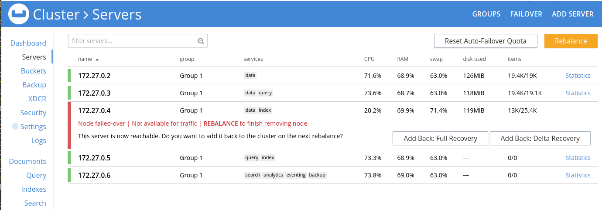

В UI  рядом с нодой появляются кнопки **Add  Back: Full  Recovery**, **Add  Back: Delta  Recovery** (жмем её). Потом запускаем **Rebalance**  и она вернулась в кластер.

### 2 тест:
Останавливаем  ноду **couch5** (с сервисами fts, eventing, analytics, backup) без Auto-Failover: ```docker  stop  couch5```

Получаем письмо ```Could not auto-failover node ('ns_1@172.27.0.6'). Number of remaining nodes that are running backup service is 0. You need at least 1 nodes.```

Пытаемся выполнить поиск FTS:
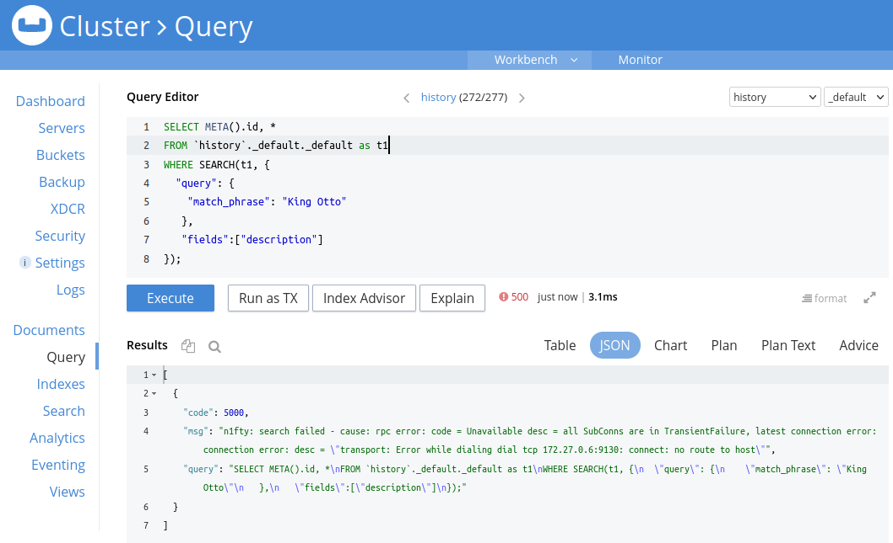
```
docker  start  couch5
```
Нода сама возвращается в строй без дополнительных усилий (т.к. для таких сервисов ребалансировка не требуется).
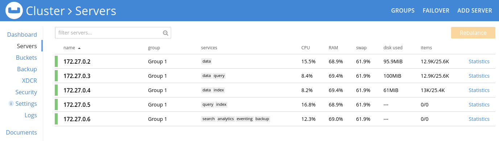

### 3 тест:

Роняем ноду **couch1** (data), на которой инициализирован весь кластер: ```docker  stop couch1```

Падает весь кластер. Письма: ```Node ('ns_1@172.27.0.2') was automatically failed over. Reason: All monitors report node is unhealthy.```

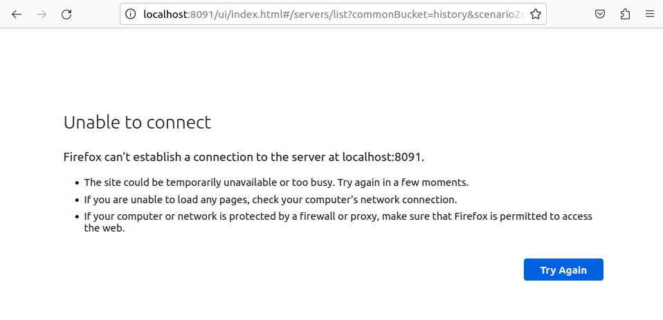

Восстанавливаем ноду ```docker  start  couch1```

Кластер поднимается.

Логинимся заново в кластере и восстанавливаем ноду уже знакомым путем **Add Back: Delta Recovery** + **Rebalance**.


По окончании тестирования останавливаем запущенные контейнеры, чистим ресурсы.
```
docker-compose down
docker container stop $(docker ps -aq) && docker container rm $(docker ps -aq)
docker network rm leont_net0
docker volume prune
```
